# Documentação Modelo Preditivo - Inteli

## ONE
### ONE
#### <a href="https://www.linkedin.com/in/antonio-guimar%C3%A3es-2bb961264/">Antônio Guimarães</a>, <a href="https://www.linkedin.com/in/danielzular/">Daniel Zular</a>, <a href="https://www.linkedin.com/in/gabriellediascartaxo/">Gabrielle Dias Cartaxo</a>, <a href="https://www.inteli.edu.br/">Mário Ventura Medeiros</a>, <a href="https://www.linkedin.com/in/pedro-henrique-coutinho-cruz/">Pedro Cruz</a>, <a href="https://www.linkedin.com/in/samuel-martins-lopes-nascimento-7a805526a/">Samuel Nascimento</a>, <a href="https://www.linkedin.com/in/thomasreitzfeld/">Thomas Reitzfeld</a>

## Sumário
[1. Introdução](#c1)

[2. Objetivos e Justificativa](#c2)

[3. Metodologia](#c3)

[4. Desenvolvimento e Resultados](#c4)

[5. Conclusões e Recomendações](#c5)

[6. Referências](#c6)

[Anexos](#attachments)


## <a name="c1"></a>1. Introdução

&emsp;Fundada em 2016, Bettha, uma startup independente da Cia. De Talentos, atua como uma plataforma voltada a contratações. Seu objetivo está na busca pela construção de conexões reais entre quem visa conectar candidatos a oportunidades ideais de carreira. Com foco principal em desenvolvimento de carreira e conexões para jovens profissionais e estudantes, a empresa opera exclusivamente online, com sede em São Paulo. O Bettha é reconhecido no mercado como uma intermediária que busca unir jovens de 18 a 24 talentos à oportunidades de forma eficiente. No entanto, seu sistema de correspondência entre candidatos e empresas têm enfrentado desafios, às vezes recomendando opções inadequadas e possivelmente aumentando a rotatividade nas empresas.

## <a name="c2"></a>2. Objetivos e Justificativa
### 2.1 Objetivos

&emsp;O Bettha busca aprimorar a experiência de seus usuários, recomendando empresas ou candidatos que se alinham melhor às suas necessidades. Além disso, a empresa tem o objetivo de fornecer _insights_ de capacitação para aproximar os candidatos das oportunidades ideais de carreira.

### 2.2 Proposta de solução

&emsp;Nossa proposta envolve a criação de um modelo preditivo avançado que avalie e identifique as qualidades únicas de cada candidato. Esse modelo será projetado para estabelecer conexões precisas entre candidatos e empresas que compartilham características e requisitos compatíveis. 

&emsp;Ao levar em consideração fatores específicos, como habilidades, valores e cultura organizacional, nosso modelo visa aprimorar a correspondência entre candidatos e empresas, tornando o processo de seleção mais eficaz e orientado para resultados. 

&emsp;Através dessa abordagem, almejamos otimizar a adaptação do candidato ao ambiente de trabalho, reduzindo significativamente as taxas de turnover e, ao mesmo tempo, contribuindo para a realização dos objetivos da Bettha de fornecer recomendações mais assertivas e valiosas aos usuários da plataforma.


### 2.3 Justificativa

&emsp;Nossa solução é distintiva devido à sua capacidade aprimorada de realizar combinações precisas entre candidatos e empresas, resultando em um "match perfeito". Ela se destaca ao oferecer aos clientes a oportunidade de encontrar tanto o candidato ideal quanto a empresa dos sonhos, ao identificar alinhamentos não apenas em termos de habilidades, mas também de valores e cultura organizacional. Isso não só eleva a qualidade das contratações, mas também contribui para a formação de equipes mais coesas e produtivas.

&emsp;Os potenciais de nossa solução são notáveis. Ao estabelecer conexões mais significativas, esperamos não apenas diminuir a taxa de turnover, mas também aumentar a satisfação do funcionário e a retenção a longo prazo. Com um melhor ajuste entre os candidatos e as empresas, os colaboradores têm maior probabilidade de prosperar em suas funções, resultando em um ambiente de trabalho mais positivo.

&emsp;Os benefícios são tangíveis: maior produtividade, redução de custos associados ao recrutamento e treinamento de substitutos, além da melhoria geral da qualidade de vida dos funcionários e do ambiente de trabalho. Nossa solução visa atender aos objetivos do Bettha, aprimorando as correspondências entre candidatos e empresas de maneira eficaz e personalizada, resultando em um sistema que se diferencia pela sua precisão, abordagem centrada no indivíduo e impacto positivo no mundo profissional.


## <a name="c3"></a>3. Metodologia

&emsp;Para o desenvolvimento do nosso modelo preditivo, utilizamos a metodologia CRISP DM (Cross Industry Standart Process for Data Mining, Processo Padrão da Indústria Cruzada para Mineração de Dados, em tradução livre). Essa metodologia surgiu com a necessidade de organizar os processos dentro de um projeto com um grande volume de dados. 
Dentro do CRISP, estão reunidas as práticas para garantir que a mineração de dados e a transformação destes em informação utilizável seja o mais eficiente possível.
Ao total, existem 6 etapas:

* Entendimento do problema
  
  Nessa primeira fase, busca-se entender a fundo a problemática a ser resolvida, mapeando os impactos e definindo quais serão os objetivos e pontos de maior atenção.
  
* Compreensão dos dados
  
  Após um entendimento sólido do problema é realizada uma análise dos dados disponíves. Investiga-se a importância de cada estrutura e como ela se relaciona com as outras, selecionando o que de fato é importante e útil para a resolução do problema.
  De maneira resumida, é o entendimento das variáveis dentro de cada tabela e o que elas representam dentro do todo. 

* Preparação dos dados
  
  Após a compreensão, é realizado o tratamento e limpeza dos dados. É nessa fase que ocorre a remoção de outliers, normalização dos dados categóricos, entre outras estratégias de pré-processamento.

* Modelagem
  
  Os dados já estão organizados. Agora, são comparados diversos tipos de modelo preditivo que podem ser aplicados e a seleção de quais possuem a maior viabilidade de utilização.
  Depois dessa análise, começa a contrução do modelo propriamente dito, separando os dados de teste e treino para o funcionamento da predição.
  
* Avaliação
  
  Nessa etapa é observado os resultados e a acurácia dos modelos para certificar que estão comprindo as métricas de avaliação previamente discutidas.
  
* Implementação

&emsp;Após o modelo preditivo ser validado, as informações que esse produz podem ser utilizadas no dia a dia da empresa, sendo levadas em consideração para a tomada de decisões.


&emsp;Um dos motivos que nos fez utilizar essa metodologia no nosso projeto foi a flexibilidade e a iterabilidade, pois é possível retornar ás fases anteriores conforme o projeto avança e ganha complexidade, sendo uma característica fundamental que reflete a natureza dinâmica e muitas vezes imprevisível da análise de dados.

&emsp;À medida que o projeto avança, a compreensão do problema e dos dados pode se desenvolver. Novas informações podem surgir, bem como mudanças nos requisitos de negócios. Muitas vezes é notado que a abordagem inicial precisa ser ajustada para produzir resultados mais precisos, relevantes ou eficazes. Esses ajustes podem envolver a coleta de novos dados, a modificação de técnicas de pré-processamento, a exploração de diferentes algoritmos de modelagem ou o reajuste dos objetivos do projeto.

&emsp;A capacidade de voltar e revisar os estágios anteriores não é apenas permitida no CRISP-DM, mas também é incentivada. Isto cria um ciclo de melhoria contínua, onde a aprendizagem e a adaptação são partes essenciais do processo. À medida que o projeto avança, cada iteração tende a ser mais informativa e produtiva do que a anterior, levando a insights mais profundos e decisões mais sólidas.

&emspEm suma, a abordagem CRISP-DM não só reconhece a possibilidade de regressar às fases anteriores, mas também a aceita como uma prática valiosa. Essa flexibilidade permite a adaptação às nuances do problema e dos dados, levando a análises mais robustas e a soluções mais eficazes para os desafios de negócios. Portanto, adaptabilidade e repetibilidade são características essenciais para projetos bem-sucedidos de ciência de dados baseados em CRISP-DM.


## <a name="c4"></a>4. Desenvolvimento e Resultados
### 4.1. Compreensão do Problema
#### 4.1.1. Contexto da indústria 

&emsp;Na figura e tabela abaixo será abordada a análise das 5 forças de Porter, que se trata de um modelo analítico que pretende entender as relações de mercado que permeiam a instituição e seu contexto prático, levando em conta a rivalidade entre concorrentes, poder de barganha de fornecedores, poder de barganha dos clientes, ameaça de produtos substitutos e ameaça de novos entrantes.

<p align="center">
<strong>Figura 1:</strong> 5 Forças de Porter

<strong>Fonte:</strong> Autoria própria <br>
<strong>Figura 2:</strong> Tabela das 5 Forças de Porter

<strong>Fonte:</strong> Autoria própria
</p>

&emsp;O poder de barganha do cliente é alto, pois há uma série de outras empresas presentes no mercado. Logo, a empresa que quer se consolidar no mercado tem que gastar mais recursos para agradar o cliente, já que há muitas opções similares no mercado. Se o cliente estiver insatisfeito, ele irá mudar a plataforma que usa, fazendo a empresa perder clientes.

&emsp;A ameaça de novos entrantes é média. Dado que é um mercado com poucas barreiras de entrada, é fácil para uma empresa ingressar no meio. Porém, para manter-se, há certa dificuldade devido à presença de empresas muito consolidadas no mercado atual. Dessa forma, empresas têm um menor interesse de adentrar no nicho.

&emsp;O mercado é bem concorrido, pois há muitas empresas com serviços similares atuantes, por exemplo: Vagas.com, LinkedIn, Catho, Gupy, entre outros. Entre as diversas opções de sites e aplicativos que possibilitam a conexão entre empresas e candidatos, há algumas que oferecem um serviço gratuito, enquanto outras cobram pelo uso. Devido a quantidade de opções para esse tipo de serviço, a disputa pelo market share na área é constante e muito distribuída.

&emsp;A ameaça de produtos substitutos é baixa, pois sempre haverá candidatos procurando por mais chances de serem contratados, além de maior visibilidade vinda das empresas. Além disso, as empresas estão em busca constante de novos empregados qualificados e capacitados. Porém, há freelancers e pessoas que podem enviar o currículo diretamente para a empresa, mas a taxa de pessoas que realizam tais ações é significativamente menor. Além disso, a tecnologia está muito avançada pelo uso de IA para ser substituída em um curto e médio prazo.

&emsp;O poder de barganha da Bettha em relação à AWS da Amazon é médio. Usando plataformas de serviços de computação em nuvem como a AWS, o esforço é considerável quando há uma necessidade de substituição de plataforma, devido ao tempo e custos envolvidos na transição de dados. Portanto, uma trsnsição é complicada mesmo no caso da AWS aumentar a mensalidade ou mudar planos. Apesar disso, o mercado oferece alternativas de alta qualidade, como Google Cloud, Microsoft Azure e Oracle Cloud, proporcionando ao Bettha várias possibilidades em caso de necessidade de mudança, o que equilibra o poder de barganha em relação a AWS.


#### 4.1.2. Análise SWOT 

&emsp;Na figura abaixo será exposta a análise SWOT da empresa, que elaboramos para entender melhor sobre o cenário interno e externo da empresa. Essa é uma análise que leva em consideração as forças, fraquezas, oportunidades e ameaças externas da empresa.

<p align="center">
<strong>Figura 3:</strong> Análise SWOT

<strong>Fonte:</strong> Autoria própria
</p>


#### 4.1.3. Planejamento Geral da Solução

*  Quais são os dados disponibilizados?

&emsp;Os dados disponíveis pela empresa, que estão todos anonimizados, foram a pontuação mínima requerida de cada habilidade e cada soft skill que as empresas requerem para a vaga e a data que foi fornecida essa pontuação. Também foi disponibilizado a pontuação das habilidades dos usuários, a pontuação em suas soft skills e o dia que foi coletada essa informação.

* Qual a solução proposta?

&emsp;Nosso projeto planeja desenvolver uma inteligência artificial para o Bettha que auxilie a conexão entre candidatos a empresas ideais, visando reduzir o turnover. Através de um modelo preditivo que considera habilidades, valores e cultura, dado que a empresa busca melhorar a seleção de candidatos e proporcionar recomendações mais eficazes, contribuindo para a adaptação no trabalho e a realização de objetivos.

* Qual o tipo de tarefa?

&emsp;O projeto desenvolvido trabalha com a tarefa de classificação. Isso ocorre com base nos dados do usuário, os quais vamos classificar em um perfil de candidato e uni-lo à dados de empresas que estão a procura daquele perfil.

* Como a solução proposta deverá ser utilizada?

&emsp;Nossa I.A será utilizada com a finalidade de proporcionar o match perfeito ao candidato e a empresa. Essa solução será integrada ao aplicativo do Bettha, onde será facilitado o processo de matchmaking, garantindo que os clientes encontrem as empresas ideais para suas habilidades e objetivos.

* Quais os benefícios trazidos pela solução proposta?

&emsp;A solução trará benefícios tanto para o Bettha quanto para seus clientes. Para a Bettha, a implementação resultará em um aumento na base de clientes, pois o sistema recomendará empresas alinhadas com os candidatos. Para os clientes, a solução oferecerá recomendações mais precisas, resultando em um alinhamento mais forte com as empresas e candidatos, além de reduzir as chances de demissões nos primeiros 6 meses.

* Qual será o critério de sucesso e qual métrica será utilizada para avaliá-lo?
  
&emsp;Para determinar o sucesso do projeto, estabelecemos critérios fundamentais que serão rigorosamente avaliados. O ponto central desse critério será a inteligência artificial contar com todas as competências comportamentais e técnicas da pessoa, o tempo de processamento do código, robustez (capacidade do modelo de lidar com dados variáveis, sendo menos propenso a problemas com _overfitting_) e explicabilidade (o grau de dificuldade de entender como o modelo atua) garantindo assim a maior porcentagem de match. Essas métricas são essenciais para assegurar que o sistema esteja funcionando de forma confiável e que as indicações de empresas e candidatos sejam altamente relevantes. Ao exigir as métricas supracitadas, estamos buscando não apenas resultados consistentes, mas também uma melhoria significativa nas decisões de contratação e nas associações a longo prazo. Esta métrica crítica será nossa bússola para avaliar o progresso e a eficácia contínua do projeto, assegurando que ele cumpra os objetivos estabelecidos com precisão e confiabilidade.

#### 4.1.4. Value Proposition Canvas

<p align="center">
<strong>Figura 4:</strong> Value Proposition Canvas

<strong>Fonte:</strong> Autoria própria
</p>

&emsp;O Cliente da Bettha sofre de um problema que muitos brasileiros também sofrem, que é encontrar um emprego que realmente combine com ele. Para isso, ele precisa de uma empresa que combine com seu estilo de vida e trabalho. O Modelo preditivo desenvolvido no nosso projeto alivia a dor desse cliente, o ligando com uma empresa perfeitamente compatível com seu perfil pessoal e profissional. Além de melhorar a experiência do cliente em si, nosso modelo preditivo pode melhorar a capacidade de crescimento da empresa, pois será usado menos tempo para fazer um match e haverá menos turnover.


#### 4.1.5. Matriz de Riscos

&emsp;Para o acompanhamento dos riscos e oportunidades que acompanham o projeto, fazemos uma matriz, mapeando as possibilidades a fim de definir planos de ação para cada uma.
Na figura abaixo, é possível visualizar nossa matriz de riscos e oportunidades.

<p align="center">
<strong>Figura 5:</strong> Matriz de Risco e Oportunidade

<strong>Fonte:</strong> Autoria própria
</p>

Descrição dos riscos e planos de ação:

* O VIA falhar
  
Caso isso aconteça, os slides não poderão ser vistos.
Plano de ação:
Ensaiar muito e ter propriedade do que será apresentado. Dessa forma, ainda que o VIA falhe, a falta de conteúdo visual não afetará a qualidade da apresentação.

* Falta de atenção no dev
  
Representa a perda de foco do time nos momentos de desenvolvimento, o que pode gerar atrasos nas entregas.
Plano de ação:
O Scrum Master da semana se responsabilizará por trazer o grupo de volta em momentos de dispersão, se notar que o foco está sendo perdido.

* Atrasar entregas entre o time

Representa não honrar combinados e datas estipuladas pelo time, atrasando tarefas pequenas durante a semana. Isso pode baixar a produtividade, atrasar entregas de artefatos e no geral diminuir a qualidade do trabalho. 
Plano de ação:
Acompanhar de perto a evolução de cada um nas dailys e manter a honestidade a respeito dos impedimentos, pedindo ajuda em casos que for notado que não será possível entregar a tarefa no prazo sem auxílio.  

* Algum integrante não estar com os estudos em dia (e portanto atrapalhar o desenvolvimento)

Caso algum integrante não esteja comprometido com seus próprios estudos, isso afetará o desenvolvimento do projeto, pois o conhecimento é a base que sustenta a prática. 
Plano de ação:
Manter os autoestudos em dia e/ou se comprometer a pesquisar materiais por fora a fim da falta de conhecimento não afetar o projeto. 


* Falha de comunicação entre os integrantes do time

A comunicação distorcida pode gerar uma série de problemas, ainda mais num trabalho colaborativo. 
Plano de ação:
Manter o combinado de não tomar decisões sem comunicar o resto do time; além disso, manter a clareza e honestidade nas reuniões diárias. Se houver falha de comunicação, tratá-la o mais rápido possível.


* A pessoa responsável por apresentar faltar

Caso não haja preparação dos outros integrantes do time, a apresentação poderá ser prejudicada.
Plano de ação:
Sempre ter alguém reserva com a apresentação ensaiada, além do time inteiro possuir um conhecimento bem estruturado do que será apresentado. Dessa forma, mesmo que alguém tenha um imprevisto e falte, a qualidade da apresentação será mantida.

* Encontrar problemas com a base de dados do parceiro
  
Caso ocorra, poderá dificultar e até impedir o andamento do projeto.
Plano de ação:
Caso ocorra, recorrer aos meios de comunicação com o parceiro para encontrar uma solução o mais rápido possível.

* Atrasar artefato
  
Caso o risco “Atrasar entregas entre o time” não seja bem gerenciado, poderá se tornar o atraso de um artefato inteiro, que além de ser mais grave, interfere no rendimento do time e nas nossas pontuações.
Plano de ação:
De forma semelhante às entregas entre o time, manter o acompanhamento das tarefas diariamente e de forma transparente nas dailys.

* Não entregar o que o parceiro solicitou (dentro do escopo)
  
Representa não conseguirmos atingir o que é esperado na TAPI. Isso só será um risco possível de acontecer caso os riscos “Atrasar entregas entre o time” e “Atrasar artefato” ocorram. Dessa forma, a probabilidade de acontecer é baixíssima.
Plano de ação:
Ter um bom gerenciamento de tempo para que o projeto não se atrase, além de entender o que o parceiro deseja para evitar sair do escopo.


#### 4.1.6. Personas


&emsp;Personas são pessoas fictícias que representam o público-alvo, deixando assim mais fácil a visualização. Temos 3 personas, cada uma representando um tipo de usuário da Bettha e do nosso projeto (Figuras 6,7,8). 


<p align="center">
<strong>Figura 6:</strong> Persona 1 <br>
<br>
<strong>Fonte:</strong> Autoria própria
</p>

<p align="center">
<strong>Figura 7:</strong> Persona 2 <br>
<br>
<strong>Fonte:</strong> Autoria própria
</p>


<p align="center">
<strong>Figura 8:</strong> Persona 3 <br>
<br>
<strong>Fonte:</strong> Autoria própria
</p>


#### 4.1.7. Jornadas do Usuário

Para mapearmos as experiências dos usuários com nosso modelo, criamos jornadas que são representações sequenciais da interação entre o usuário e o modelo. Essas jornadas acompanham o usuário desde o momento em que enfrenta uma dificuldade até o momento em que descobre e interage com nossa solução. O objetivo dessas jornadas é auxiliar no entendimento da experiência do usuário e na identificação de pontos de melhoria.

A primeira jornada mapeada aborda a persona que acabou de iniciar sua carreira profissional e está em busca vagas de emprego, como está ilustrado na figura 9. A segunda jornada, por sua vez, procura mapear o ganho das empresas com o nosso modelo, que passarão a ter contratações bem mais assertivas, diminuindo assim a taxa de *turnover*, como pode-se visualizar na figura 10.

<p align="center">
<strong>Figura 9:</strong> Jornada do Usuário 1<br>
<br>
<strong>Fonte:</strong> Autoria própria
</p>

<p align="center">
<strong>Figura 10:</strong> Jornada do Usuário 2<br>
<br>
<strong>Fonte:</strong> Autoria própria
</p>


#### 4.1.8 Política de Privacidade

<strong> 1. Introdução </strong> 
>A presente Política de Privacidade (“Política”) explica os detalhes essenciais da relação dos dados pessoais do Usuário com o ONE, e se aplica à plataforma em que ficam armazenados o banco de currículos do GCT (Grupo Cia de Talentos), que abrange tanto os currículos cadastrados via www.ciadetalentos.com.br, que ficam hospedados na plataforma ATS Globe, quanto os cadastrados via www.bettha.com, hospedados na plataforma Bettha.
 
>Os termos que regem a utilização de referidas plataformas pelo Usuário estão definidos nos nossos Termos e Condições de Uso, dos quais esta Política faz parte.
Essa Política será atualizada quando necessário, sobretudo sempre que a plataforma, suas funcionalidades e usos sofrerem mudanças que resultem em alguma alteração na forma como coletamos e tratamos os dados pessoais do Usuário.
 
>A presente Política tem como propósito
explicar ao Usuário os respectivos direitos em relação aos seus dados pessoais coletados e tratados por nós, além de informar de que forma protegeremos a sua privacidade, assim garantindo que o Usuário entenda quais dos seus dados pessoais coletamos, as razões pelas quais os coletamos e utilizamos.

>Esperamos que a presente Política auxilie o Usuário a compreender os nossos compromissos referentes à sua privacidade. Se tiver quaisquer dúvidas ou preocupações, consulte o Item 12: "Fale conosco" para obter informações sobre como entrar em contato com nossa equipe. Por outro lado, se o Usuário não concordar com o conteúdo da presente Política, destacamos que este é livre para decidir se pretende se cadastrar e utilizar a plataforma do ONE ou não, podendo, entretanto, em alguns casos, escolher não compartilhar certos dados opcionais.


2.1  	
>A Lei Geral de Proteção de Dados ('Lei n.º 13.709/18' ou 'LGPD') confere determinados direitos aos indivíduos relativos aos seus respectivos dados pessoais. Conforme previsto nos termos da legislação aplicável e salvo se limitados pela mesma, os direitos previstos aos indivíduos são os seguintes:

>>Direito de confirmação da existência de tratamento;

>>Direito de acesso aos dados;

>>Direito de correção de dados incompletos, inexatos ou desatualizados;

>>Direito à anonimização, bloqueio ou eliminação de dados desnecessários, excessivos ou tratados em desconformidade com a LGPD;

>>Direito à portabilidade dos dados a outro fornecedor de serviço ou produto, resguardados os segredos comerciais e industriais do Bettha;

>>Direito à eliminação dos dados pessoais tratados com o consentimento do titular, exceto nas hipóteses de guarda legal e outras dispostas na LGPD;

>>Direito à informação das entidades públicas e privadas com as quais o Bettha realizou o uso compartilhado de dados;

>>Direito à informação sobre a possibilidade de não fornecer o consentimento e sobre as consequências da negativa;

>>Direto à revogação do consentimento, nos termos da LGPD.
	
2.2. Se você quiser excluir, bloquear ou exercer quaisquer dos direitos atrelados aos seus dados pessoais, arrolados no item anterior, favor entrar em contato conosco enviando e-mail para:
	>a) meajuda@grupociadetalentos.com.br, para cadastros no site www.ciadetalentos.com.br.
	>b) contato@bettha.com, para cadastros no site https://www.bettha.com.

2.3. Se lhe enviarmos mensagens de publicidade eletrônica com base no seu consentimento ou de outra forma permitida pela lei aplicável, o Usuário poderá, em qualquer momento, respectivamente, retirar o seu consentimento ou declarar a sua recusa, sem custos adicionais. As mensagens de publicidade eletrônica que o Usuário recebe do GCT, como as enviadas através de e-mail, incluem um mecanismo de recusa dentro da própria mensagem, por exemplo, um link para cancelamento da inscrição nos e-mails que lhe enviamos
.
<strong> 3. Como coletamos os dados pessoais do Usuário? </strong> 
>Coletamos os dados pessoais do Usuário das seguintes formas:

>><strong> a. Quando o Usuário subscreve à plataforma usada pelo GCT (se registra, se inscreve ou se cadastra): </strong>  para se cadastrar no banco de currículos do GCT é necessário que o USUÁRIO informe determinados dados pessoais, tais como nome completo, número de Cadastro de Pessoa Física ('CPF'), endereço de e-mail, número de telefone celular, grau de escolaridade, áreas de interesse, conhecimento de idiomas, cidade, estado e país, que são coletados pelo GCT para envio de convite(s) para participar tanto de processo(s) seletivo(s); quanto de pesquisa(s) e/ou evento(s) relacionados à carreira e/ou mercado de trabalho, bem como para realizar eventuais trilhas de desenvolvimento profissional disponibilizadas.
  
>><strong> b. Através da utilização da plataforma adotada pelo GCT: </strong>  quando o Usuário acessa o banco de currículos, realiza testes nele disponibilizados, se candidata a processos seletivos e/ou participa de pesquisas e/ou eventos para os quais foi convidado e/ou realiza trilhas de desenvolvimento profissional que venham a ser disponibilizadas, coletamos dados pessoais a partir dessa utilização de modo automático ou semiautomático;
 
>><strong> c. Dados pessoais cujo fornecimento é opcional e que são coletados para proporcionar ao Usuário mais oportunidades: </strong> eventualmente, o Usuário também poderá nos fornecer dados pessoais adicionais ou nos autorizar a recolhê-los, por exemplo, para lhe fornecer mais oportunidades de emprego, trainee ou estágio. Conforme descrito abaixo, não coletamos, sem autorização prévia do usuário, fotografias, vídeos, orientação sexual, dados referentes à saúde, localização ou dados de voz. O Usuário poderá sempre mudar de ideia e retirar o seu consentimento a qualquer momento.
<strong> Através de terceiros: </strong> receberemos dados pessoais do Usuário através de terceiros, incluindo empresas clientes, parceiros com quem trabalhamos, plataformas autorizadas pelo Usuário como o Linkedin, Gmail ou Facebook para lhe enviar convite para participação de processo seletivo, evento, pesquisa, dentre outros interesses relacionados à carreira e mercado de trabalho. Utilizaremos estes dados pessoais se o Usuário tiver autorizado os terceiros em questão.


<strong> 4. Quais dados pessoais do Usuário coletamos </strong> 


><strong> a. Dados de registro da Conta GCT: </strong> Trata-se dos dados pessoais fornecidos pelo usuário ou coletados por nós para que o Usuário possa se cadastrar no banco de currículos do GCT. Inclui o nome completo, número de Cadastro de Pessoa Física ('CPF'), endereço de e-mail, número de telefone celular, grau de escolaridade, áreas de interesse, conhecimento de idiomas, cidade, estado e país do usuário.
 
>Alguns dados pessoais solicitados são obrigatórios para que o Usuário possa criar a sua conta. O usuário também tem a opção de nos fornecer alguns dados pessoais complementares para torná-la mais personalizada.
 
>Os dados pessoais que coletamos dependem se o usuário utiliza um serviço de terceiros, como por exemplo, o Linkedin, Gmail ou Facebook, para efetuar seu cadastro/criar uma conta. Se o Usuário utilizar um serviço de terceiros para criar uma conta, receberemos dados pessoais através desse serviço de terceiros, mas apenas se o usuário tiver autorizado o serviço do terceiro em questão a compartilhar conosco os seus dados pessoais.
 
>O cadastro no banco de currículos do GCT permite ao usuário acessar, com o mesmo usuário e senha, tanto o banco de currículos da Cia de Talentos, quanto do Bettha identificados no início desta Política, assim >como a plataforma ATS Globe (www.atsglobe.com). A plataforma ATS Globe é o ambiente que hospeda o banco de currículos GCT e, nessa condição, possui seu próprio Termo de Uso, bem como sua própria Política de Privacidade, que é similar a esta Política.


><strong> b. Dados de pessoas com as quais o Titular tenha trabalhado: </strong>  Em relação a processos de recrutamento e seleção, são coletados dados pessoais (nome, telefone e/ou e-mail) de pessoas com as quais o Titular tenha trabalhado, para fins de obtenção de referências profissionais.


><strong> c. Dados sobre a utilização da Plataforma: </strong> São os dados pessoais coletados sobre o Usuário quando este está utilizando a plataforma adotada pelo GCT, o que poderá incluir:
Informações sobre as interações do usuário com a plataforma, incluindo a data e hora de quaisquer ações, como atualizações cadastrais. Pode igualmente incluir informações sobre a utilização de aplicações de terceiros e publicidade que receber, tais como os LOGS dos sistemas;
 
>Conteúdos inseridos na plataforma pelo Usuário, incluindo as mensagens que enviar ou receber através da plataforma, as informações fornecidas nas inscrições para processos seletivos, além de suas interações com a Equipe de Apoio do GCT; e
 
>Dados técnicos, que poderão incluir informações de URL, dados de cookies, o endereço IP do Usuário, os tipos de dispositivos por este utilizados para acessar a Plataforma, identificações exclusivas do dispositivo, atributos do dispositivo, tipo de ligação à rede (por exemplo, Wi-Fi, 3G, LTE, Bluetooth) e fornecedor de rede, desempenho da rede e do dispositivo, tipo de navegador, idioma, informações que permitam a gestão dos direitos digitais, sistema operativo e versão da Plataforma.
 
>Dados anonimizados para diversos fins, que incluem: testar os nossos sistemas de TI, análise de dados, compartilhar dados referentes à saúde, criar modelos de marketing e promoção, melhorar o serviço CIA DE >TALENTOS e desenvolver novos recursos e funcionalidades na Plataforma.


><strong> d. Dados opcionais: </strong> Além dos dados que coletamos para enviar ao Usuário convites para participar de processos de recrutamento e seleção, pesquisas e eventos relacionados à carreira e ao mercado de trabalho, bem como para realizar as trilhas de desenvolvimento dos quais participa, o Usuário tem também a opção de nos fornecer dados pessoais adicionais para que possamos fornecer-lhe recursos e funcionalidades que irão melhorar a sua experiência junto ao GCT. Não iremos coletar nenhum dos dados pessoais abaixo referidos sem antes obter o consentimento do Usuário:


>As fotografias e vídeos do Usuário: só coletaremos as imagens e vídeos que o Usuário escolher especificamente compartilhar conosco e os metadados relacionados dessas imagens, tais como o tipo de ficheiro e o tamanho da imagem e do vídeo;
 
>A origem racial ou étnica, e a orientação sexual: apenas coletaremos essas informações quando o Usuário escolher especificamente compartilhá-las conosco;
 
>Pessoa com Deficiência: somente coletaremos essa informação referente à saúde do Usuário se este optar especificamente por nos fornecê-la;
 
>A localização precisa do dispositivo do Usuário: se o Usuário nos der autorização para acessar a localização precisa, poderemos fornecer funcionalidades da plataforma que necessitem de localização;
 
>se o Usuário nos der autorização, podemos acessar os comandos de voz coletados através do microfone do dispositivo do Usuário, para permitir que este utilize, através de voz, certas funcionalidades a eles disponibilizadas, como a realização de entrevistas virtuais.


><strong> e. Sorteios e Promoções: </strong>  Os dados pessoais são utilizados para convidar o Usuário para participar destes tipos de sorteios e promoções. Os dados pessoais coletados variam conforme a promoção.


><strong>f. Estes dados pessoais são utilizados para permitir ao GCT, por si próprio ou através de terceiros, enviar comunicações de marketing ao Usuário: </strong>

>por e-mail, telefone, aplicativos de comunicação a exemplo de whatsapp e do Telegram,
 
>durante a utilização da Plataforma, e/ou
 
>diretamente do terceiro contratado pelo GCT para enviar comunicações de marketing
 
>através de eventos


<strong> 5. Para quais finalidades utilizamos os dados pessoais do Usuário? </strong> 

>Quando o Usuário interage com a Plataforma, utilizamos diversas tecnologias para tratar os dados pessoais coletados sobre o Usuário por vários motivos. Na tabela abaixo, expomos os motivos pelos quais tratamos os dados pessoais do Usuário, os fundamentos jurídicos associados em que nos baseamos e que nos permitem legalmente efetuar o tratamento dos dados pessoais do Usuário, e os grupos de dados pessoais utilizados para estas finalidades:

 <p align="center">
<strong>Figura 11:</strong> Tabela a respeito do item 5.<br>
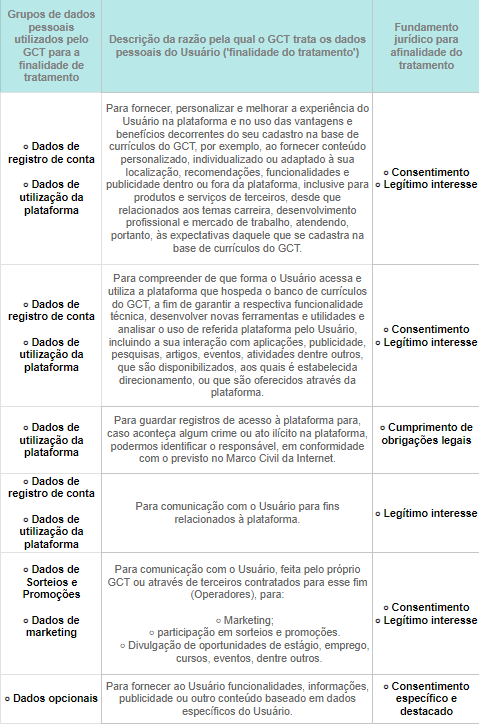<br>
<strong>Fonte:</strong> Autoria própria
</p>

<strong> 6. Compartilhamento dos dados pessoais do Usuário </strong>
	Definimos os grupos de destinatários dos dados pessoais coletados ou gerados através da utilização da plataforma pelo Usuário.


><strong> Dados pessoais que o Usuário poderá optar por compartilhar</strong>
>Os seguintes dados pessoais só serão compartilhados com os grupos de destinatários indicados na tabela abaixo se o Usuário:
>Autorizar explicitamente o compartilhamento dos dados pessoais, por exemplo, selecionando a definição adequada na Plataforma.
  
 <p align="center">
<strong>Figura 12:</strong> Tabela a respeito do item 6.<br>
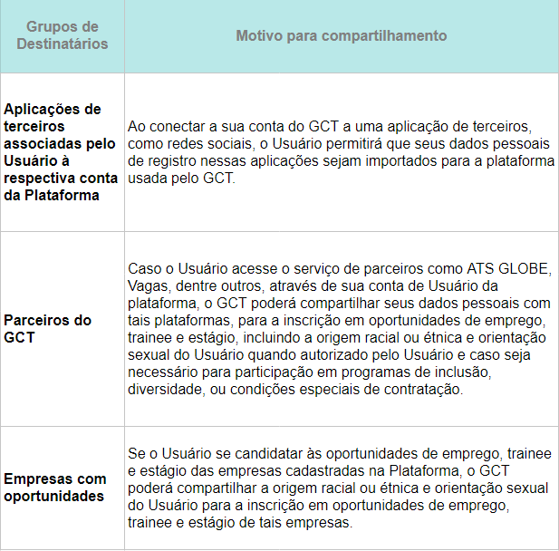<br>
<strong>Fonte:</strong> Autoria própria
</p>

<strong>Informações que poderemos compartilhar</strong>
  <p align="center">
<strong>Figura 13.1:</strong> Tabela a respeito do item 6.1<br>
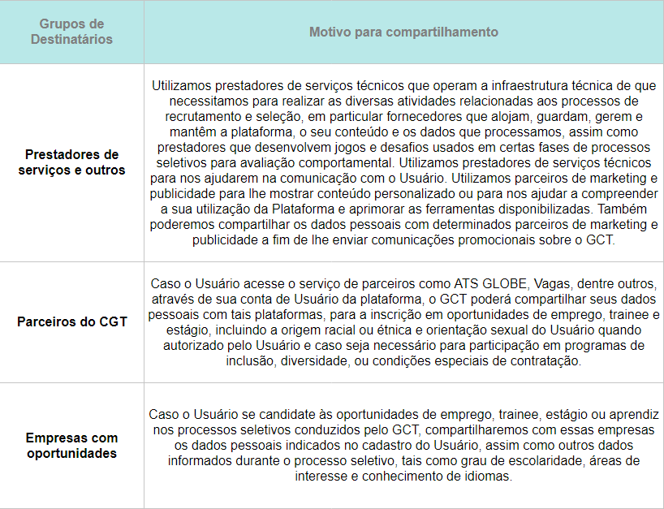<br>
<strong>Fonte:</strong> Autoria própria
</p>
  <p align="center">
<strong>Figura 13.2:</strong> Tabela a respeito do item 6.1 (continuação da anterior)<br>
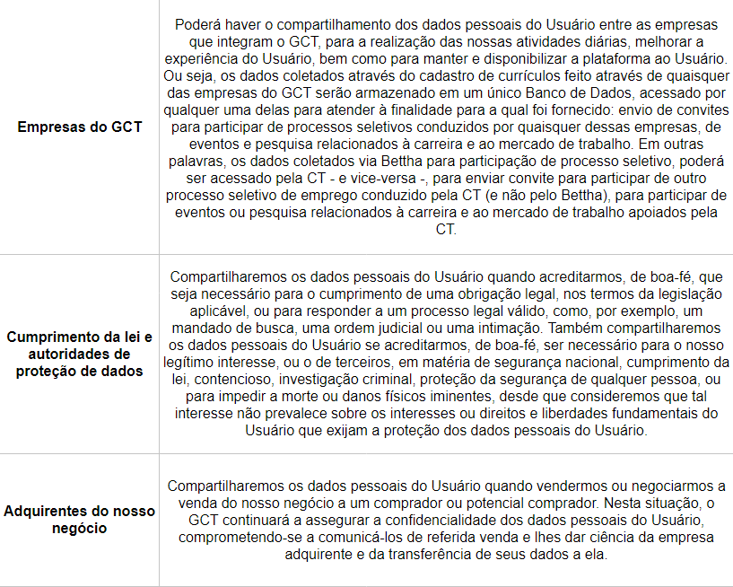<br>
<strong>Fonte:</strong> Autoria própria
</p>

<strong>7. Tratamento de dados pessoais em outro país </strong> 
Eventualmente, por força de processo seletivo para o qual o Usuário se candidatou, alguns de seus dados poderão ser remetidos para tratamento em outro país, Para países ou organismos internacionais que 	proporcionem grau de proteção de dados pessoais adequado ao previsto na LGPD.
 
>Isso poderá ocorrer nas seguintes situações:
 
>>(a) a vaga de trabalho se localiza fora do Brasil;
  
>>(b) a análise dos dados dos candidatos finalistas se dá pela sede da empresa contratante situada fora do Brasil; e
  
>>(c) alguns prestadores de serviços que desenvolvem testes, jogos e/ou desafios usados em certas fases de processos seletivos para avaliação comportamental estão situados fora do Brasil
.
<strong>8. Conservação e eliminação de dados</strong> 

>Conservamos os dados pessoais do Usuário enquanto for necessário para o desenvolvimento dos processos de recrutamento e seleção conduzidos pelo GCT e para fins comerciais legítimos e essenciais, tais como para manter o desempenho da plataforma, tomar decisões empresariais acerca de funcionalidades e ofertas com base em dados, cumprir as nossas obrigações legais, e resolver disputas. Conservamos alguns dos 	dados pessoais do Usuário enquanto este permanecer como Usuário da plataforma. Por exemplo, mantemos todos os dados cadastrais e resultados de assessments na sua conta.
 
>A pedido do Usuário, vamos eliminar os dados pessoais tratados com o consentimento do Titular ou anonimizar os dados pessoais nos termos da LGPD de modo que não o identifiquem, exceto se for legalmente permitido ou obrigatório manter determinados dados pessoais, incluindo situações como as seguintes:
 
>>a. Se existir um problema não resolvido relativamente à sua conta, como uma reclamação ou disputa não resolvida, iremos reter os dados pessoais necessários até que o problema seja solucionado;
  
>>b. Se formos obrigados a manter os dados pessoais para as nossas obrigações jurídicas, fiscais, de auditoria, contabilidade e conformidade com a LGPD, iremos reter os dados pessoais necessários pelo período exigido pela legislação aplicável;
  
>>c. Sempre que necessário para os nossos legítimos interesses comerciais, como a prevenção contra fraudes ou para manter a segurança dos nossos Usuários.


<strong> 9. Links de terceiros </strong> 

>Poderemos apresentar anúncios de terceiros e outros conteúdos com links para endereços eletrônicos de terceiros. Não é possível controlarmos, nem sermos responsabilizados por práticas de privacidade e conteúdo de terceiros. Se o Usuário clicar em um anúncio ou link de terceiros, deverá estar ciente de que sairá da Plataforma e de que quaisquer dados pessoais que venha a fornecer não estarão abrangidos pela presente Política. O Usuário deverá ler as respectivas políticas de privacidade para saber de que forma coletam e tratam os seus dados pessoais.
 
<strong> 10. Manter os dados pessoais do Usuário em segurança </strong> 

>Estamos empenhados em proteger os dados pessoais dos nossos Usuários. Implementamos medidas técnicas e organizacionais para ajudar a proteger a segurança dos dados pessoais do Usuário. No entanto, o Usuário deve ter ciência de que nenhum sistema é completamente seguro. Implementamos várias políticas, entre elas de anonimização, políticas de acesso e de retenção para prevenir contra o acesso não autorizado e a retenção desnecessária de dados pessoais nos nossos sistemas.

>A senha protege a conta de Usuário, por isso incentivamos o Usuário a utilizar uma senha única e forte, a limitar o acesso ao computador e navegador e a encerrar a sessão depois de utilizar a Plataforma.
 
<strong> 11. Crianças e Adolescentes </strong>

>A Plataforma se destina a Usuários com 14 anos de idade ou mais. Estão disponíveis mais detalhes acerca desta matéria nos nossos Termos e Condições de Uso.
 
>><strong>Base legal.</strong> Todos os dados coletados de Usuários entre 14 e 18 anos incompletos serão tratados com fundamento nas bases legais listadas no item 5 desta Política ou com base no consentimento do seu responsável legal, quando aplicável.

>><strong>Dados tratados.</strong> Os dados tratados serão aqueles listados no item 4 desta Política, exceto dados de saúde relacionados a deficiências, testes e outros métodos de avaliação psicológica.

>><strong>Finalidades.</strong> Os dados coletados desses Usuários serão tratados unicamente para as finalidades listadas no item 5 desta Política, mas não serão utilizados para fins de marketing.

>><strong>Compartilhamento.</strong> Os dados de Usuários menores de 18 anos serão compartilhados nas hipóteses do item 6 desta Política, exceto para fins de marketing ou comunicação com parceiros não essenciais para execução dos serviços ou fornecimento de funcionalidades expressamente solicitadas pelo Usuário.

>Se você é pai ou responsável legal de uma criança ou adolescente que forneceu dados pessoais à plataforma de modo indevido, você pode entrar em contato conosco e poderá solicitar o exercício dos seus direitos aplicáveis que se encontram discriminados no Item 2 da presente Política. O contrato deverá observar o quanto segue:


>Se o cadastro se deu pelo site https://www.bettha.com, abrir o chamado neste site, no campo 'fale com a gente'.

>Se o cadastro se deu pelo site www.ciadetalentos.com.br, abrir um atendimento online nesse site, clicando em contato e depois em 'dúvidas'.

>Se tomarmos conhecimento de que coletamos dados pessoais de um adolescente sem que este tenha se identificado como tal ou de um usuário que não reúna as condições mínimas para utilização da Plataforma, tomaremos as medidas razoáveis para eliminar os dados pessoais em questão, restringir tal conta e/ou notificar o responsável legal. Para tal, poderá ser necessário eliminar a conta no GCT relativa a essa criança ou adolescente.

<strong>12. Alterações à presente Política de Privacidade</strong>

>Eventualmente, poderemos efetuar alterações à presente Política.
 
>Quando realizarmos alterações materiais à presente Política, faremos uma comunicação visível e adequada de acordo com as circunstâncias, como por exemplo, apresentando uma notificação na Plataforma ou através do envio de um e-mail ao Usuário. Poderemos também enviar antecipadamente uma notificação ao Usuário.

>Assim, é fundamental que o Usuário se certifique de ler qualquer notificação atentamente.

>Se quiser saber mais sobre a presente Política e como a Plataforma utiliza os dados pessoais do Usuário, entre em contato conosco no endereço eletrônico lgpd@grupociadetalentos.com.br para saber mais.
 
<strong>13. Fale com o GCT</strong>

>Obrigado por ler a nossa Política de Privacidade. Se tiver dúvidas relativamente à presente Política, contate o nosso Responsável pela Proteção de Dados através do e-mail lgpd@grupociadetalentos.com.br ou escrevendo para o seguinte endereço:
 
>GRUPO CIA DE TALENTOS
>Avenida das Nações Unidas, No. 12901, CENU Torre Norte, 11º andar, sala 11-133, Brooklin Paulista, São Paulo (SP), Brasil, CEP 04578-000
>O GCT é a responsável pelo tratamento de dados pessoais do Usuário processados nos termos desta Política.
>Esperamos que encontre sua melhor oportunidade pelo GCT!

>© GRUPO CIA DE TALENTOS.


### 4.2. Compreensão dos Dados

#### 4.2.1. Exploração de dados

&emsp;Segue abaixo algumas informações a respeito de cada coluna de todas as tabelas que o cliente disponibilizou, citando tambem se as colunas são numéricas ou categóricas.

&emsp;Estatísticas Descritivas Gerais:

&emsp;Tabela: job_opportunity_superfit_consolidates_filtrado.csv  

```
__Coluna: score_res (Númerica)__  
          score_res	  
count    165.000000  
mean      32.448485  
std        6.181607  
min       16.000000  
Q1        28.000000  
Mediana   32.000000  
Q3        36.000000  
max       46.000000  

__Coluna: score_eng (Númerica)__  
          score_eng  
count    165.000000  
mean      29.406061  
std        6.932512  
min       10.000000  
Q1        26.000000  
Mediana   30.000000  
Q3        34.000000  
max       46.000000  

__Coluna: score_int (Númerica)__  
          score_int  
count    165.000000  
mean      33.890909  
std        7.389031  
min       16.000000  
Q1        28.000000  
Mediana   34.000000  
Q3        38.000000  
max       52.000000  

__Coluna: score_cur (Númerica)__  
          score_cur  
count    165.000000  
mean      26.909091  
std        6.961408  
min       12.000000  
Q1        22.000000  
Mediana   26.000000  
Q3        32.000000  
max       46.000000  

__Coluna: score_sin (Númerica)__  
          score_sin  
count    165.000000  
mean      33.260606  
std        5.976475  
min       16.000000  
Q1        28.000000  
Mediana   34.000000  
Q3        38.000000  
max       48.000000  

__Coluna: score_dis (Númerica)__  
          score_dis  
count    165.000000  
mean      35.830303  
std        7.513909  
min        8.000000  
Q1        30.000000  
Mediana   36.000000  
Q3        42.000000  
max       52.000000  

 
Tabela: job_opportunity_workstyle_consolidates_filtrado.csv  
__Coluna: score_classic (Númerica)__  
         score_classic  
count       165.000000  
mean          1.618182  
std           0.902049  
min           0.000000  
Q1            1.000000  
Mediana       1.500000  
Q3            2.000000  
max           4.000000  

__Coluna: score_order (Númerica)__  
         score_order  
count     165.000000  
mean        4.224242  
std         1.274044  
min         1.000000  
Q1          3.500000  
Mediana     4.000000  
Q3          5.000000  
max         7.000000  

__Coluna: score_change (Númerica)__  
         score_change  
count      165.000000  
mean         4.327273  
std          1.091339  
min          1.500000  
Q1           3.500000  
Mediana      4.500000  
Q3           5.000000  
max          7.000000  

__Coluna: score_tireless (Númerica)__  
         score_tireless  
count        165.000000  
mean           4.106061  
std            1.117745  
min            1.500000  
Q1             3.500000  
Mediana        4.000000  
Q3             5.000000  
max            7.500000  

__Coluna: score_explorer (Númerica)__  
         score_explorer  
count        165.000000  
mean           3.360606  
std            1.411611  
min            0.000000  
Q1             2.000000  
Mediana        3.000000  
Q3             4.500000  
max            7.000000  

__Coluna: score_specialist (Númerica)__  
         score_specialist  
count          165.000000  
mean             2.133333  
std              1.079370  
min              0.000000  
Q1               1.000000  
Mediana          2.000000  
Q3               3.000000  
max              4.000000  

__Coluna: score_generalist (Númerica)__  
         score_generalist  
count          165.000000  
mean             2.133333  
std              1.161020  
min              0.000000  
Q1               1.000000  
Mediana          3.000000  
Q3               3.000000  
max              4.000000  

 
Tabela: journeys_inteli.csv  
__Coluna: average_rating (Númerica)__  
         average_rating  
count        314.000000  
mean           4.872611  
std            0.228933  
min            4.000000  
Q1             5.000000  
Mediana        5.000000  
Q3             5.000000  
max            5.000000  

__Coluna: ratings_count (Númerica)__  
         ratings_count  
count       315.000000  
mean       1022.790476  
std        6003.809918  
min           0.000000  
Q1           42.500000  
Mediana     151.000000  
Q3          381.500000  
max       93008.000000  

 
Tabela: user_interests_inteli.csv  
__Coluna: name (Categórica)__  
                 name  
count    52817.000000  
mean         6.137058  
std          2.798084  
min          1.000000  
Q1           4.000000  
Mediana      6.000000  
Q3           9.000000  
max         11.000000  


 
Tabela: user_lifestyle.csv  
__Coluna: chave (Categórica)__  
               chave  
count    67508.00000  
mean         9.43543  
std          2.89635  
min          1.00000  
Q1           7.00000  
Mediana      8.00000  
Q3          12.00000  
max         15.00000  

__Coluna: lifestyle_classic (Númerica)__  
         lifestyle_classic  
count         67508.000000  
mean              2.216078  
std               0.869838  
min               0.000000  
Q1                1.500000  
Mediana           2.000000  
Q3                3.000000  
max               8.500000  

__Coluna: lifestyle_order (Númerica)__  
         lifestyle_order  
count       67508.000000  
mean            3.464056  
std             1.324757  
min             0.000000  
Q1              2.500000  
Mediana         3.500000  
Q3              4.500000  
max            24.500000  

__Coluna: lifestyle_change (Númerica)__  
         lifestyle_change  
count        67508.000000  
mean             5.775182  
std              1.552299  
min              0.000000  
Q1               4.500000  
Mediana          6.000000  
Q3               7.000000  
max             18.000000  

__Coluna: lifestyle_tireless (Númerica)__  
         lifestyle_tireless  
count          67508.000000  
mean               4.740016  
std                1.334286  
min                0.000000  
Q1                 4.000000  
Mediana            4.500000   
Q3                 5.500000  
max               22.500000  

__Coluna: lifestyle_explorer (Númerica)__  
         lifestyle_explorer  
count          67508.000000  
mean               5.032241  
std                1.381420  
min                0.000000  
Q1                 4.000000  
Mediana            5.000000  
Q3                 6.000000  
max               23.500000  

__Coluna: lifestyle_specialist (Númerica)__  
         lifestyle_specialist  
count            67508.000000  
mean                 1.859143  
std                  1.165238  
min                  0.000000  
Q1                   1.000000  
Mediana              2.000000  
Q3                   3.000000  
max                  5.000000  

__Coluna: lifestyle_generalist (Númerica)__  
         lifestyle_generalist  
count            67508.000000  
mean                 1.470907  
std                  1.112443  
min                  0.000000  
Q1                   1.000000  
Mediana              1.000000  
Q3                   2.000000  
max                  5.000000  

__Coluna: lifestyle_hybrid (Númerica)__  
         lifestyle_hybrid  
count        67508.000000  
mean             0.876444  
std              0.931191  
min              0.000000  
Q1               0.000000  
Mediana          1.000000  
Q3               1.000000  
max              4.000000  

 
Tabela: user_superfit.csv  
__Coluna: superfit_dis (Númerica)__  
         superfit_dis  
count    73959.000000  
mean        57.326681  
std          9.131010  
min          0.000000  
Q1          52.000000  
Mediana     58.000000  
Q3          64.000000  
max         90.000000  

__Coluna: superfit_sin (Númerica)__  
         superfit_sin  
count    73959.000000  
mean        49.855569  
std          8.213067  
min          0.000000  
Q1          44.000000  
Mediana     50.000000  
Q3          56.000000  
max         90.000000  

__Coluna: superfit_cur (Númerica)__  
         superfit_cur  
count    73959.000000  
mean        44.041591  
std         10.283265  
min          0.000000  
Q1          38.000000  
Mediana     44.000000  
Q3          50.000000  
max         94.000000  

__Coluna: superfit_int (Númerica)__  
         superfit_int  
count    73959.000000  
mean        52.177369  
std          9.636396  
min          0.000000  
Q1          46.000000  
Mediana     52.000000  
Q3          58.000000  
max         92.000000  

__Coluna: superfit_eng (Númerica)__  
         superfit_eng  
count    73959.000000  
mean        48.233643  
std         10.148993  
min          2.000000  
Q1          42.000000  
Mediana     50.000000  
Q3          56.000000  
max         90.000000  

__Coluna: superfit_res (Númerica)__  
         superfit_res  
count    73959.000000   
mean        51.197664  
std          9.477999  
min          4.000000  
Q1          46.000000  
Mediana     52.000000  
Q3          58.000000  
max         88.000000  

 
Tabela: users_tests_inteli.csv  
__Coluna: ingles_conceito (Categórica)__  
         ingles_conceito  
count        4536.000000  
mean            2.421958  
std             1.401242  
min             1.000000  
Q1              1.000000  
Mediana         2.000000  
Q3              4.000000  
max             5.000000  

__Coluna: ingles_nota (Númerica)__  
         ingles_nota  
count    4536.000000  
mean        4.333149  
std         3.336353  
min         0.268000  
Q1          1.140000  
Mediana     3.254000  
Q3          8.073000  
max         9.560000  

__Coluna: excel_conceito (Categórica)__  
         excel_conceito  
count       4536.000000  
mean           1.565917  
std            0.577851  
min            1.000000  
Q1             1.000000  
Mediana        2.000000  
Q3             2.000000  
max            3.000000  

__Coluna: excel_nota (Númerica)__  
          excel_nota  
count    4536.000000  
mean        4.988977    
std         3.004056  
min         0.000000  
Q1          3.000000  
Mediana     5.000000    
Q3          7.000000  
max        14.000000  

__Coluna: solu_conceito (Categórica)__  
         solu_conceito  
count      4536.000000  
mean          2.431437  
std           0.881098  
min           1.000000  
Q1            2.000000  
Mediana       2.000000  
Q3            3.000000  
max           4.000000  

__Coluna: solu_nota (Númerica)__  
           solu_nota  
count    4536.000000  
mean        4.947222  
std         2.099214  
min         0.000000  
Q1          3.300000  
Mediana     5.000000  
Q3          6.500000  
max        10.000000  

```

&emsp;A seguir, apresento alguns gráficos que foram elaborados usando dados de quatro tabelas distintas. Esses gráficos visam aprimorar a compreensão durante o processo de aprendizado de Inteligência Artificial.

&emsp;O gráfico abaixo (Figura 14) possui a média de cada coluna de acordo com a sua chave, referente a tabela user_superfit.csv

<p align="center">
<strong>Figura 14:</strong> Gráfico média das chaves da tabela user_superfit.csv
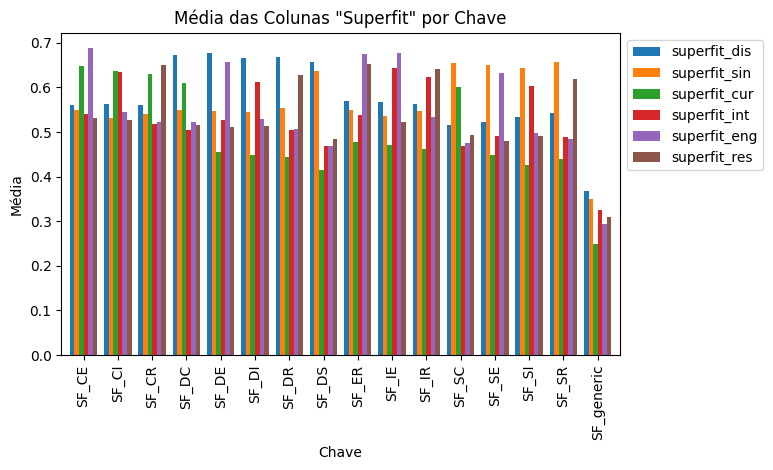
<strong>Fonte:</strong> Autoria própria <br>

&emsp;O gráfico abaixo (Figura 15) é a média de cada coluna pela sua chave também, referente a tabela user_lifestyle.csv

<p align="center">
<strong>Figura 15:</strong> Gráfico média das chaves da tabela user_lifestyle.csv
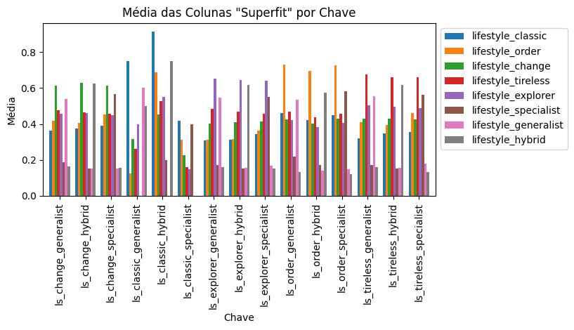
<strong>Fonte:</strong> Autoria própria <br>

&emsp;O gráfico abaixo (Figura 16) mostra a média de cada coluna, referente a tabela job_opportunity_workstyle_consolidates.csv

<p align="center">
<strong>Figura 16:</strong> Gráfico média dos scores da tabela job_opportunity_workstyle_consolidates.csv
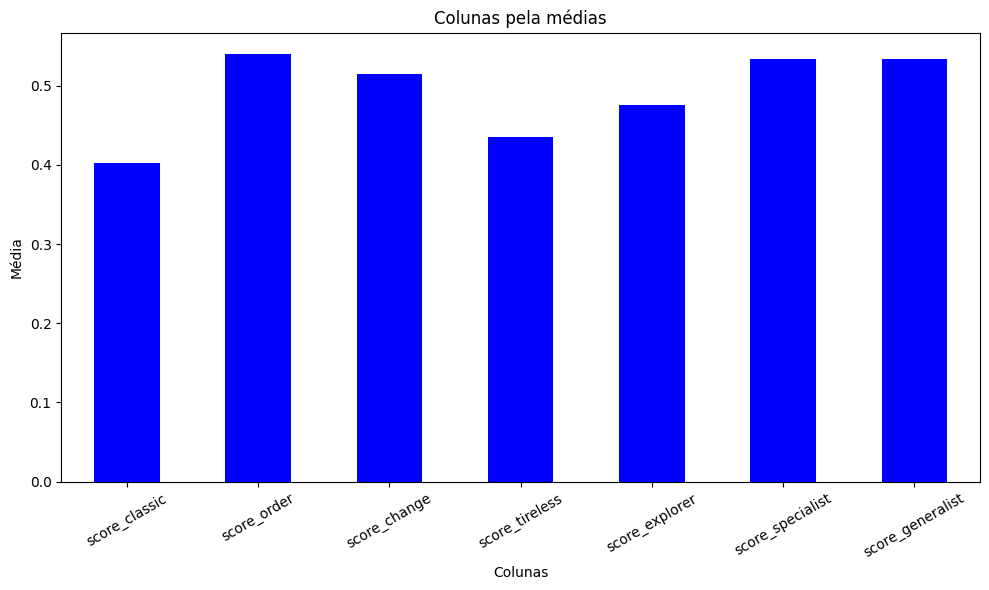
<strong>Fonte:</strong> Autoria própria <br>

&emsp;O gráfico abaixo (Figura 17) mostra a frequencia que cada "Status" aparece na coluna Distribuição de Frequências, referente a tabela dados_filtrados.csv

<p align="center">
<strong>Figura 17:</strong> Gráfico frequência de cada "Status" na tabela dados_filtrados.csv
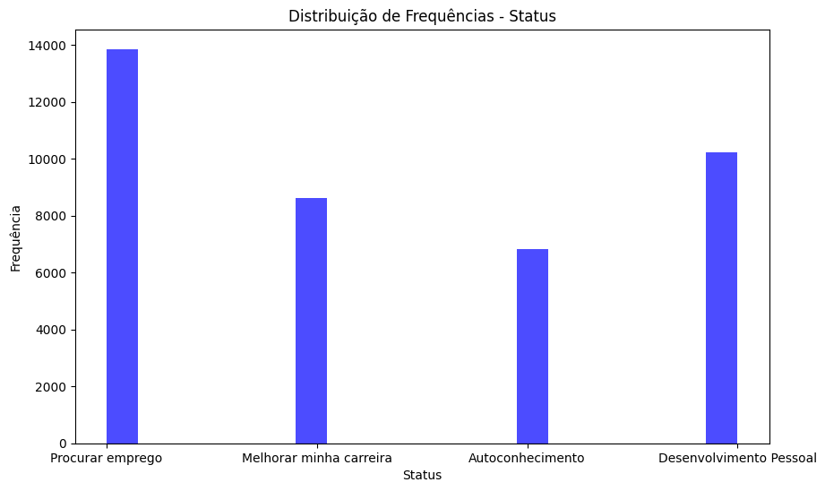
<strong>Fonte:</strong> Autoria própria <br>

#### 4.2.2. Pré-processamento dos dados

&emsp;O pré-processamento dos dados é realizado a fim de tornar os dados que recebemos da Bettha funcionais para nosso uso durante o projeto. Para isso, fizemos tranformações em algumas tabelas, mudando os dados categóricos para dados numéricos, a fim de nos auxiliar no processo de análise desses dados e quantificação.


&emsp;Dentro da tabela User_Lifestyle, na coluna key, os dados abaixo foram substituídos pelos respectivos números:

1 - classic_specialist 

2 - classic_generalist

3 - classic_hybrid

4 - order_specialist

5 - order_generalist

6 - order_hybrid

7 - change_specialist

8 - change_generalist

9 - change_hybrid

10 - tireless_specialist

11 - tireless_generalist

12 - tireless_hybrid

13 - explorer_specialist

14 - explorer_generalist

15 - explorer_hybrid


&emsp;Dentro da tabela Users_tests_inteli, os dados alterados são das seguintes colunas:

* ingles_conceito:
  
1 - A1

2 - A2

3 - B1

4 - B2

5 - C1


* excel_conceito:
  
1 - Básico

2 - Intermediário

3 - Avançado


* solu_conceito:
  
1 - Iniciante

2 - Pré_Eficiente

3 - Eficiente

4 - Proficiente


&emsp;Outra tabela transformada foi a users_interests_inteli, dentro da coluna name, os seguintes dados foram transformados:

1 - Finanças / Contabilidade

2 - Logística / Supply Chain

3 - Engenharia

4 - Tecnologia

5 - Produção / Operações

6 - Comercial / Vendas

7 - RH

8 - Marketing / Comunicação

9 - Administrativo

10 - Saúde

11 - Jurídico

&emsp;Em suma, esses são os dados que transformamos. Para realizar essa padronização, utilizamos o SQLite, realizando chamadas UPDATE TABLE a fim de trocar as informações dentro das tabelas. 

#### 4.2.3. Hipóteses

1. Hipótese: Quanto menor a variação entre os scores dos empregos comparado aos scores das disciplinas dos candidatos; mais apto estará o mesmo para a vaga. Porém, caso a diferença entre qualquer disciplina e o score do candidato seja maior que 30% o candidato deverá ser descartado, além disso os resultados da variação para as categorias superfit terão peso dobrado.  
A soma da diferença entre os scores por categoria representa o quão longe ou perto o candidato está da mínima exigida pela empresa, sendo que se o resultado for negativo, significa que o candidato está apto a vaga selecionada. Os 30% evitam que uma vaga que requer elevado nível de uma habilidade em específico, mesmo que o candidato tenha resultado negativo na fórmula, ele não será apto a vaga, pois não apresenta o mínimo possível de nível daquela habilidade que ela requer.


2. Hipótese: Caso um candidato esteja muito bem pontuado em relação a 2 scores de uma vaga, porém um pouco abaixo em um terceiro, podemos assumir que ele poderia ser contratado pois o "pouco" que falta para um score  pode ser ensinado, devida a compatibilidade demonstrada nos outros scores.


3. Hipótese: São escolhidas as 3 habilidades de superfit e de lifestyle/workstyle mais requeridas da vaga e compara com as do candidato. Se todos forem maiores, compare o quanto generalista e específico o candidato é e quanto a vaga requerer. Se o candidato tiver números maiores nas duas comparações, ele é apto a vaga.  
Esse modelo identifica as principais habilidades que a vaga requere e compara com o candidato para ver se ele cumpre todos os requisitos. Depois disso, compara para ver se ele é generalista/especialista o suficiente para aquela vaga, identificando se o candidato é apto ou não.


### 4.3. Preparação dos Dados e Modelagem

&emsp;O objetivo deste projeto é aprimorar o processo de correspondência entre candidatos e vagas de emprego por meio do desenvolvimento de modelos de sistema de recomendação. Esses modelos são projetados para identificar e sugerir vagas de emprego que melhor se ajustem ao perfil de habilidades e expectativas dos candidatos, resultando em um processo de contratação mais eficiente e satisfatório.

**Coleta de Dados:**

&emsp;Para todos os modelos apresentados neste projeto, foi realizada uma etapa de coleta de dados. Os dados coletados incluem informações sobre candidatos e vagas, com métricas de superfit e lifestyle que refletem as habilidades dos candidatos e as expectativas das empresas em relação a essas habilidades. Esses dados servem como base para a construção e treinamento dos modelos de sistema de recomendação. Dessa forma, as features usadas incluem:

- `score_res`
- `score_eng`
- `score_int`
- `score_cur`
- `score_sin`
- `score_dis`
- `score_classic`
- `score_order`
- `score_change`
- `score_tireless`
- `score_explorer`
- `score_specialist`
- `score_generalist`

&emsp;Todos os modelos produzidos utilizam dessas mesmas features, mas manuseando-as de maneiras distintas. Segue abaixo uma descrição detalhada do funcionamento de cada modelo candidato:

**Modelo 1: Sistema de Recomendação de Vagas com Base em Correspondência de Habilidades**

**Modelagem para o Problema:**
Este modelo é um sistema de recomendação de vagas que se baseia na correspondência de habilidades entre candidatos e empresas. A modelagem do problema envolveu os seguintes passos:

1. **Engenharia de Features:** As características do modelo foram definidas com base em todas as métricas de superfit e lifestyle. Para a correspondência, as diferenças entre as métricas de superfit e lifestyle dos candidatos e as métricas das empresas foram calculadas.
2. **Cálculo da Correspondência:** Foi calculada uma pontuação de correspondência para cada candidato em relação a cada vaga. A pontuação de correspondência foi obtida a partir das diferenças entre as métricas de superfit e lifestyle, ponderadas igualmente. Quanto menor a diferença, maior a pontuação de correspondência.
3. **Recomendação de Vagas:** Com base nas pontuações de correspondência, o modelo recomenda as melhores vagas para cada candidato.

**Discussão dos Resultados do Modelo 1:**

&emsp;O primeiro modelo candidato mostrou bons resultados na recomendação de vagas com base na correspondência de habilidades. A acurácia foi relativamente alta, o que indica que o modelo está fazendo recomendações precisas para a maioria dos candidatos. A matriz de confusão também revelou um número significativo de verdadeiros positivos, o que significa que o modelo está identificando com sucesso as vagas relevantes para os candidatos.

**Modelo 2: Sistema de Recomendação com Base nas Habilidades Mais Importantes**

**Modelagem para o Problema:**
Este modelo também é um sistema de recomendação de vagas, mas se baseia nas habilidades mais importantes, tanto dos candidatos quanto das empresas. A modelagem do problema envolveu os seguintes passos:

1. **Engenharia de Features:** As características do modelo foram definidas com base nas métricas de superfit e lifestyle. Para determinar as habilidades mais importantes, o modelo identificou as três métricas de superfit mais altas para as empresas e as quatro métricas de lifestyle mais altas.
2. **Cálculo da Correspondência:** A correspondência entre candidatos e empresas foi calculada com base nas métricas identificadas como mais importantes. O modelo calculou a diferença entre as métricas do candidato e da empresa para essas habilidades selecionadas.
3. **Recomendação de Vagas:** Com base nas pontuações de correspondência, o modelo recomendou as melhores vagas para cada candidato.

**Discussão dos Resultados do Modelo 2:**

&emsp;O segundo modelo candidato mostrou resultados promissores na recomendação de vagas com base nas habilidades mais importantes. A abordagem de escolher as habilidades mais relevantes para a correspondência levou a recomendações que se alinham melhor com as expectativas das empresas.

**Modelo 3: Sistema de Recomendação com Base na Similaridade de Cosseno**

**Modelagem para o Problema:** 
Este modelo é um sistema de recomendação de vagas que se baseia na similaridade de cosseno entre as habilidades de candidatos e empresas. A modelagem do problema envolveu os seguintes passos:

1. **Engenharia de Features:** As características do modelo foram definidas com base em todas as métricas de superfit e lifestyle.
2. **Cálculo da Similaridade de Cosseno:** A similaridade de cosseno foi calculada entre as habilidades dos candidatos e das empresas. Quanto maior a similaridade, mais próximas estão as habilidades.
3. **Recomendação de Vagas:** Com base nos índices de similaridade de cosseno, o modelo recomendou as melhores vagas para cada candidato.

**Discussão dos Resultados do Modelo 3:**

&emsp;O terceiro modelo candidato, que utiliza a similaridade de cosseno, fornece recomendações de vagas com base na proximidade das habilidades dos candidatos em relação às expectativas das empresas. Esta abordagem pode ser eficaz para identificar vagas que melhor correspondem ao perfil de um candidato.

&emsp;Em relação à justificativa para a escolha do K, ele pode ser definido por meio de técnicas como validação cruzada ou análise dos dados disponíveis. Um valor adequado de K deve equilibrar a qualidade das recomendações e a eficiência computacional do modelo.

&emsp;A escolha de um sistema de recomendação baseado em similaridade de cosseno foi feita com base na simplicidade e na capacidade de lidar com dados de habilidades. No entanto, a escolha final deve ser validada com base nos resultados obtidos em relação às métricas de desempenho e às necessidades específicas do projeto.

&emsp;Em suma, em relação à avaliação geral dos 3 modelos candidatos, encontramos problemas devido à limitação na quantidade de dados fornecidos pelo Bettha, o que faz com que as métricas de predição possam não ser calculadas com um grau de confiabilidade ideal. A quantidade e qualidade dos dados desempenham um papel fundamental na avaliação precisa dos modelos de aprendizado de máquina. Neste contexto, embora tenhamos desenvolvido estratégias e abordagens para a criação de modelos de correspondência candidato-vaga, a insuficiência de dados pode afetar a capacidade dos modelos de generalizar e fornecer previsões precisas. Portanto, é crucial considerar esses resultados com cautela e reconhecer que, para uma avaliação mais precisa, seria necessária uma base de dados mais ampla e representativa. Por isso, essas métricas não estão sendo disponibilizadas como resultado na análise de cada modelo, uma vez que seriam métricas enviesadas devido à falta de dados disponibilizados.

### 4.4. Comparação de Modelos

- Descrever e justificar a escolha da métrica de avaliação dos 
  modelos com base no que é mais importante para o problema ao 
  se medir a qualidade desses modelos;
- Descrever ao menos três modelos candidatos, seus respectivos 
  algoritmos, seus tunings de hiperparâmetros e suas métricas 
  alcançadas;

Modelo de recomendação com sugestão de melhoria afim de entrar em uma empresa;

&emsp; Nosso modelo de recomendação aprimorado opera da seguinte maneira: inicialmente, calculamos a diferença entre o score desejado pela empresa e o score do usuário, avaliando assim a adequação do candidato às expectativas da empresa. Em seguida, computamos as médias das distâncias entre esses scores, levando em consideração todos os aspectos do "superfit" e "lifestyle", e armazenamos essas médias em duas variáveis distintas. Para determinar a compatibilidade global, criamos uma coluna denominada "match" para cada candidato e empresa. Nessa coluna, calculamos a soma ponderada das médias de "superfit" e "lifestyle", dividindo o resultado por 3 para obter a pontuação final. Por fim, identificamos os candidatos com as maiores pontuações "match", destacando seus IDs e os IDs das empresas correspondentes. Esse aprimorado processo de recomendação nos permite encontrar as melhores correspondências entre candidatos e empresas, considerando vários critérios e atribuindo pesos apropriados para cada dimensão de compatibilidade.

&emsp;Para fornecer recomendações para que os candidatos possam aprimorar suas chances de ingressar na empresa X, desenvolvemos um algoritmo sofisticado. Este algoritmo avalia a diferença entre as pontuações dos candidatos e os requisitos da empresa, e em seguida, apresenta os resultados em um gráfico de radar. O objetivo principal deste gráfico é destacar as competências em que os candidatos têm a maior discrepância em relação aos requisitos da empresa.

&emsp;Além disso, criamos um gráfico de radar adicional com duas "faces". Este gráfico exibe tanto os valores exigidos pela empresa quanto os valores do candidato, permitindo que o candidato avalie sua proximidade em relação aos critérios da empresa. Se o candidato apresentar uma diferença maior que 0,5 em qualquer critério, o algoritmo fornecerá recomendações específicas sobre quais áreas precisam ser aprimoradas.

&emsp;Essa abordagem baseada em gráficos de radar oferece aos candidatos uma visão clara de suas forças e fraquezas em relação aos requisitos da empresa, permitindo que eles se concentrem em melhorar as áreas mais relevantes para alcançar suas metas de emprego. Para determinar a compatibilidade global, criamos uma coluna denominada "match" para cada candidato e empresa. Nessa coluna, calculamos a soma das médias de "superfit" e "lifestyle", dividindo o resultado por 2 para obter a pontuação final.

Modelo de recomendação com base nas principais <i>skills </i>requiridas;

&emsp;O moedelo de recomendação com base nas principais <i>skills</i> funciona da seguinte maneira: inicialmente, identificamos as maiores notas de <i>superfit</i> das empresas e as maiores notas de <i>workstyle</i>. A quantidade das notas foram feitas de duas maneiras, um modelo que usa as 3 maiores notas de <i>superfit</i> e as 4 maiores notas de <i>workstyle</i>, e outro modelo que usa as 4 maiores notas de <i>superfit</i> e as 5 maiores notas de <i>workstyle</i>.

&emsp;Em seguida, calculamos a diferença entre o score desejado pela empresa e o score do usuário, avaliando assim a adequação do candidato às expectativas da empresa. Em seguida, computamos as médias das distâncias entre esses scores e armazenamos essas médias em duas variáveis distintas. Por fim, identificamos os candidatos com as maiores pontuações "match", destacando seus IDs e os IDs das empresas correspondentes. Esse aprimorado processo de recomendação nos permite encontrar as melhores correspondências entre candidatos e empresas, considerando apenas as <i>skills</i> que a empresa mais julga importante para o candidato ter.

Modelo de recomendação com base na similaridade de estilo e aptidão:

 O modelo de recomendação com base na similaridade de estilo e aptidão opera da seguinte forma: Primeiro, identifica-se o perfil específico de um usuário baseado em suas métricas de <i>superfit</i> e de <i>lifestyle</i>. Estas métricas cobrem uma ampla gama de características, com o <i>superfit</i> focando em atributos como 'dis', 'sin', 'cur', 'int', 'eng' e 'res', enquanto o <i>lifestyle</i> examina tendências comportamentais como 'classic', 'order', 'change', 'tireless', 'explorer', 'specialist' e 'generalist'.

 Depois de extrair estas métricas para um usuário específico, o modelo computa a similaridade de cosseno entre o perfil do usuário e os perfis de diversas empresas, usando suas respectivas métricas de <i>superfit</i> e de <i>lifestyle</i>. Ao calcular a similaridade de cosseno, é possível identificar quão alinhado está um usuário com os requisitos e estilos de vida de uma empresa.

 Uma vez computadas as pontuações de similaridade, o modelo então ordena estas pontuações e seleciona as top_n empresas mais similares ao perfil do usuário. Esta abordagem garante que as recomendações sejam personalizadas, ressaltando as empresas que mais provavelmente estarão em sintonia com os atributos e estilos de vida do usuário.

### 4.5. Avaliação

&emsp;O modelo de recomendação com sugestão de melhoria foi escolhido devido à sua capacidade de priorizar os critérios estabelecidos no item 4.1, que incluem as notas dos testes de personalidade, competências técnicas, tempo de processamento do código, robustez para evitar overfitting e outros problemas relacionados ao processamento de dados variáveis, bem como a explicabilidade do modelo. Abaixo será analisada cada métrica detalhadamente comparando entre os modelos.

&emsp;Primeiramente, será comparado os modelos em relação a tempo de execução, sendo que todos estão sendo autuados em um mesmo _dataframe_ de mais de um milhão de linhas, sendo cada linha um candidato e uma empresa relacionada. Como podemos ver na figura 21, o modelo de recomendação com sugestão de melhoria foi executado em um tempo de 15 segundos. Em comparação, o modelo de recomendação com base nas principais _skills_ requeridas foi executada em 8.8 segundos, considerando as 3 maiores do _superfit_ e as 4 maiores do _lifestyle_, enquanto a que considera as 4  maiores do _superfit_ e as 5 maiores do _lifestyle_ foi executada em 11 segundos. O modelo de recomendação com base na similaridade de estilo e aptidão foi executado em 0.2 segundos. Todos os modelos retornaram tempos de execução satisfatórios, não afetando o desempenho e a usabilidade do modelo.

&emsp;Sobre a explicabilidade, fator que avalia o grau de dificuldade de entendimento do código e algoritmo, o modelo de recomendação com sugestão de melhoria e o modelo de recomendação com base nas principais características requeridas são os que apresentam melhor explicabilidade, com o modelo de recomendação com base na similaridade de estilo e aptidão tendo uma explicabilidade insuficiente. 

&emsp;Pode se notar na figura 19 o cálculo que os dois primeiros modelos fazem, sendo que o de recomendação com sugestão de melhoria considera todas as _features_ que há no _dataframe_, enquanto o modelo com base nas principais características só considera as 3 maiores do _superfit_ e as 4 maiores do _lifestyle_ ou  4  maiores do _superfit_ e as 5 maiores do _lifestyle_. O grau de dificuldade de entendimento do modelo é bem baixo, pois usa usa uma equação matemática para calcular os matchs, enquanto o modelo de recomendação com base na similaridade de estilo e aptidão (Figura 20) tem uma dificuldade de entendimento muito maior, pois como o cálculo é feito automaticamente pelo modelo, é difícil entender como ele faz esse cálculo e retorna o match.

&emsp; Sendo assim, considerando explicabilidade os modelos de recomendação com sugestão de melhoria e de recomendação com base nas principais características requeridas são os que possuem vantagem nesse quesito. 

&emsp;Em relação às __features__, após uma análise minuciosa, concluímos que o modelo que considera todas elas se destacou como o mais eficiente e adequado para atender às necessidades da empresa. Isso ocorre devido à complexidade das prioridades da empresa, em que o valor mais alto nem sempre é o único critério relevante.

&emsp;Nesse contexto, a escolha do modelo que leva em conta todas as características se justifica, uma vez que oferece uma visão mais abrangente e precisa das possíveis correspondências. Portanto, nossa recomendação é a adoção desse modelo abrangente para conduzir as recomendações de correspondências.

&emsp;Como resultado desse processo de seleção rigoroso, optamos por descartar o modelo baseado na similaridade por cosseno e o modelo de recomendação que se baseia apenas em determinadas __features__. Essa decisão visa aprimorar significativamente a qualidade e a eficácia das recomendações, alinhado-as melhor com os objetivos e as prioridades da empresa.

&emsp;Na avaliação da robustez, métrica que avalia a capacidade do algoritmo de lidar com dados variáveis, temos um pequeno desequilíbrio entre os modelos, uma vez que o modelo de recomendação com sugestão de melhoria apresenta uma robustez média, pois ele calcula a média das  __features__, fazendo com que um _outlier_ não muda muito, mas apresenta algumas variâncias no resultado. O  modelo de recomendação com base na similaridade de estilo e aptidão tem uma robustez baixa, pois como ele não pode ser devidamente testado devido à ausência de dados de validação, não é possível quantificar seu desempenho em condições variáveis. O modelo de recomendação com base nas principais _skills_ requeridas tem os melhores resultado nesse critério, visto que o algoritmo não considera os dados variáveis, somente aqueles que estão dentro dos parâmetros “normais”.

&emsp;Com base nisso, o modelo escolhido foi o modelo de recomendação com sugestão de melhoria, pois é o modelo que apresenta melhor resultados em geral, considerando as quatro métricas citadas anteriormente.

<p align="center">
<strong>Figura 19:</strong>Equação usada pelo Modelo de recomendação com base nas principais _skills_ requeridas<br>
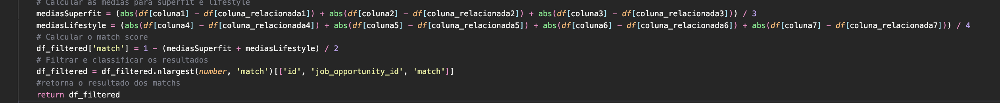<br>
<strong>Fonte:</strong> Autoria própria
</p>

<p align="center">
<strong>Figura 20:</strong>Modelo de recomendação com base na similaridade de estilo e aptidão<br>
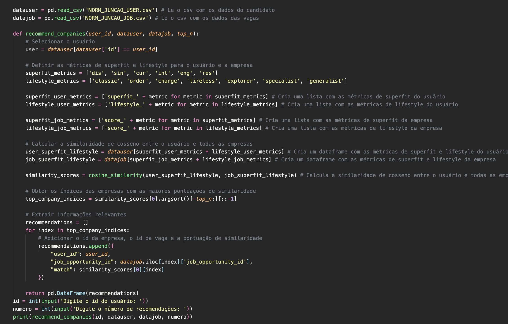<br>
<strong>Fonte:</strong> Autoria própria
</p>

<p align="center">
<strong>Figura 21:</strong>Comparação dos tempos de execução dos modelos<br>
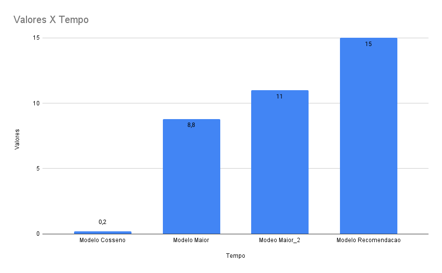<br>
<strong>Fonte:</strong> Autoria própria
</p>

## <a name="c5"></a>5. Conclusões e Recomendações

&emsp;Após conduzirmos uma análise abrangente dos dados fornecidos, visando criar um modelo capaz de conectar efetivamente candidatos às empresas mais adequadas, desenvolvemos três modelos distintos para atender a diferentes necessidades. Ao finalizar esses modelos, realizamos uma análise comparativa detalhada para identificar aquele que ofereceu os melhores resultados em termos de precisão, velocidade e capacidade de processar grandes volumes de dados. Com base nessa avaliação criteriosa, selecionamos o modelo que consideramos mais apropriado para o Bettha.

&emsp;Este modelo escolhido será uma ferramenta valiosa para o Bettha. Além de recomendar as empresas que melhor combinam com o candidato, também fornece uma funcionalidade adicional fundamental: oferece aos usuários insights sobre como melhorar suas chances de serem contratados pela empresa dos seus sonhos. Isso é feito por meio da identificação de áreas de melhoria nos perfis dos candidatos, como aquisição de habilidades específicas e o aprimoramento de experiências anteriores.

&emsp;Nossas recomendações formais à Bettha incluem a implantação gradual do modelo, começando com um grupo de teste limitado, para permitir uma avaliação cuidadosa antes de uma implementação em larga escala. Além disso, enfatizamos a importância do treinamento contínuo do modelo, que envolve atualizá-lo regularmente com novos dados.

&emsp;Devido à natureza sensível das decisões de carreira influenciadas pelo modelo, destacamos a necessidade de transparência e ética em seu uso. Recomendamos que a Bettha estabeleça diretrizes claras para o uso responsável do modelo e esteja aberta ao feedback constante dos usuários para aprimorar a experiência.

&emsp;Estamos comprometidos em apoiar o Bettha na implementação eficaz e ética deste modelo preditivo, que não só conecta candidatos a empresas, mas também oferece orientações valiosas para melhorar as chances de sucesso dos usuários. Estamos à disposição para fornecer assistência contínua e suporte conforme necessário.

## <a name="c6"></a>6. Referências

https://docs.python.org/3/library/index.html || Último acesso em 02/09/2023

https://pandas.pydata.org || Último acesso em 02/09/2023

https://numpy.org/pt/ || Último acesso em 02/09/2023

https://matplotlib.org || Último acesso em 02/09/2023

https://plotly.com/python/plotly-express/ || Último acesso em 02/09/2023

https://scikit-learn.org || Último acesso em 02/09/2023

https://chat.openai.com || Último acesso em 02/09/2023

## Glossário
<strong>Soft-Skills:</strong> Termo que se refere à habilidades comportamentais ou psicológicas, são habilidades menos técnicas e mais humanas.<br>
<strong>Turnover:</strong> Turnover é um indicativo que mostra a quantidade de funcionários que saíram da empresa em determinado período. Quanto mais alto o turnover, mais frequentemente a empresa troca de funcionários.<br>
<strong>Insights:</strong> Idéias <br>
<strong>Match:</strong> “Encontro” entre candidato e empresa que tem maior compatibilidade
